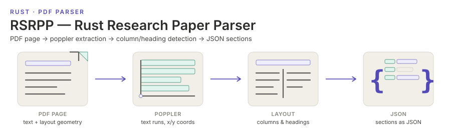

<p align="center"></p>

[English](README.md) | **日本語**


# Rust Research Paper Parser (RSRPP)


RSRPP は研究論文の PDF を構造化された節の集合に変換する．poppler を駆動してテキストと
その座標を取り出し，段組みのレイアウトと，どの行が節見出しなのかを判定して，各節が本文・
図表のキャプション・数式，そして必要なら参考文献を持つ JSON を出力する．Rust のライブラリ
と CLI の両方で提供され，論文を 1 本ずつではなくコーパス単位で回すことを前提に作られている．

## インストール

```bash
# Ubuntu/Debian
sudo apt install poppler-utils libopencv-dev clang libclang-dev

# macOS (Homebrew)
brew install poppler opencv pkg-config

# Fedora/RHEL
sudo dnf install poppler-utils opencv-devel clang clang-devel
```

```bash
cargo add rsrpp          # ライブラリ
cargo install rsrpp-cli  # CLI
```

OpenCV は動的リンクで，これを必要とするのは既定で有効な `table-detection` フィーチャだけ
である．CLI をインストールする前に [インストール](docs/install.ja.md) を読んでほしい．

```bash
rsrpp --pdf "https://arxiv.org/pdf/1706.03762" --out attention_paper.json --verbose
```

## ドキュメント

- [何のためのものか](docs/usecases.ja.md) — このパーサがどんな問題に合わせて作られているか
- [インストール](docs/install.ja.md) — 前提パッケージ，OpenCV のリンク，`table-detection` フィーチャ
- [CLI](docs/cli.ja.md) — オプション，環境変数，終了コード
- [ライブラリ](docs/library.ja.md) — `ParserConfig`，制限，一時ファイル，エラーハンドリング
- [出力フォーマット](docs/output.ja.md) — 節のフィールド，数式のマークアップ，テキストカバレッジ
- [アーキテクチャ](docs/architecture.ja.md) — モジュール構成と，それぞれが何を判定しているか
- [テスト](docs/testing.ja.md) — ユニットテストと E2E テスト，そしてコーパスで変更を測ること
- [リリース](docs/releases.ja.md) — バージョン履歴

## ライセンス

MIT．[LICENSE](LICENSE) を参照．

- [Crates.io — rsrpp](https://crates.io/crates/rsrpp)
- [Crates.io — rsrpp-cli](https://crates.io/crates/rsrpp-cli)
